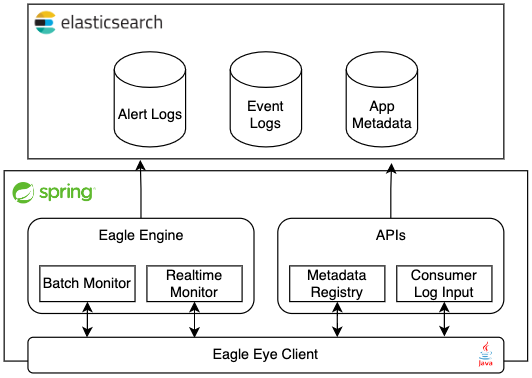

# eagle-eye

The purpose of this repository is to develop and maintain the open source Eagle Eye project.

# High Level Design

## Elastic Search Indexes

- **alert_logs** -> contain all the alerts raised based on the engine monitor
  jobs. This jobs either run in a batch job or real time. This will be based on the
  configuration created by the consumer
- **event_logs** -> these are logs that will be use to monitor a single event on one
  or across multiple applications hosted in different environments.
- **app_meta** -> will contain the metadata of the applications that will be monitored
  by Eagle Eye. Each configuration will contain variues attributes describing the behavior
  of an application and if there is any relationship to another application.

## Engine

The Eagle Eye Engine is in charge of consume the logs and log alerts in case an anomaly
in a system is detected. The engine will run based on the consumer configurations. Both
batch and realtime monitor jobs will perform the same functionalities, however they will
run based on where the use of schedule, or when an event is triggered.

### Batch Monitor [TODO: Add design diagrams]

### Realtime Monitor [TODO: Add design diagrams]

## APIs

## Eagle Eye Client