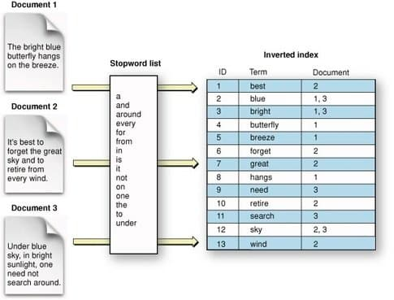

# ElasticSearch Analyzers

## Standard Analyzer

Used for text fields if specified in an index. This analyzer will only analyze text and will
remove symbols, spaces, periods, and other characters not used for analysing the text.

Example:

```
    GET _analyze
    {
      "text": ["this is john :-) ..."],
      "analyzer": "standard"
    }
```

Analyzer Result

```
    {
      "tokens": [
        {
          "token": "this",
          "start_offset": 0,
          "end_offset": 4,
          "type": "<ALPHANUM>",
          "position": 0
        },
        {
          "token": "is",
          "start_offset": 5,
          "end_offset": 7,
          "type": "<ALPHANUM>",
          "position": 1
        },
        {
          "token": "john",
          "start_offset": 8,
          "end_offset": 12,
          "type": "<ALPHANUM>",
          "position": 2
        }
      ]
    }
```

## Inverted Index

Is a concept in which, it will sort the tokens of a text in alphabetical order. This will make
search easy, since we can see how often a token is repeated in different documents.



When a text is analyzed, the result will be stored in a inverted index. Will be processed by
Apache Lucene.

Other data structures like dates, geospatial data and numeric values are stored as BKD trees, which
is a lot more efficient for those datatype.
